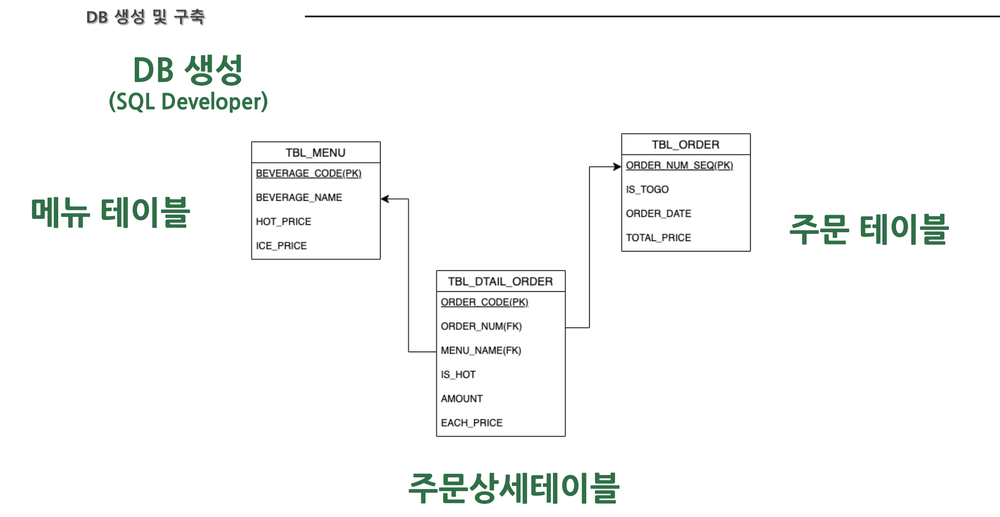
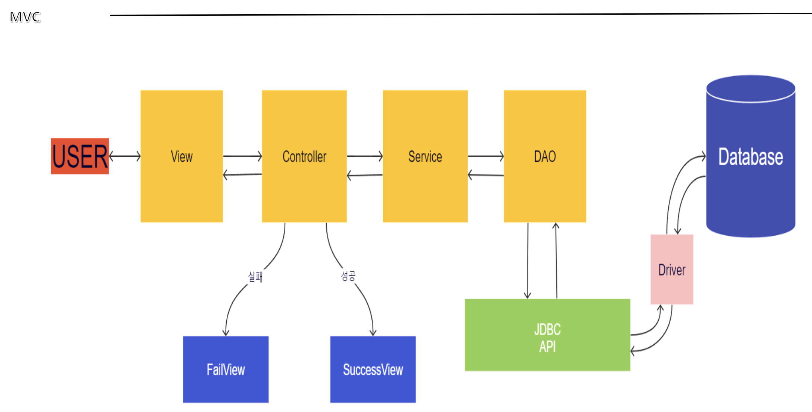

# ☕️ ZOOMBUCKS

> 커피주문 키오스크 서비스
> 
> 프로젝트 목표 : JDBC를 통해 DB를 연동하여 키오스크 서비스 구현해보기
> 
> 기대효과 : 카페에서 키오스크의 기능을 사용할 수 있다.
> 
> 시연영상 👉

## ⚒️ 스택
**Language** : JAVA11 / OracleDataBase 21C XE

**Develop Tool** : Eclipse

**Manage Tool** : Git

## 🗓️ 프로젝트 기간
- 2022.04.03 ~ 2022.04.06 (총 4일)

## 🔥 주요 기능
```
1. 음료 메뉴 전체 조회
2. 음료에 대한 정보 상세보기
3. 주문하기
  3-1. 메뉴선택
  3-2. 수량 
  3-3. HOT/ICE 선택
  3-4. 추가주문 여부 선택
4. 주문한 내역 보여주고 총 결제금액 계산 후 고객에게 보여줌 
```

## 💾 DataBase 구조


## MVC


## 🗂️ 프로젝트 폴더 구조
```
📦resources
 ┣ 📂schema
 ┃ ┗ 📜Coffee_Order.sql
 ┗ 📜.DS_Store
📦src
 ┣ 📂cafe
 ┃ ┣ 📂common
 ┃ ┃ ┣ 📜DBManager.java
 ┃ ┃ ┗ 📜DBProperties.java
 ┃ ┣ 📂controller
 ┃ ┃ ┗ 📜CafeController.java
 ┃ ┣ 📂dao
 ┃ ┃ ┣ 📜CoffeeDAO.java
 ┃ ┃ ┣ 📜CoffeeDAOImpl.java
 ┃ ┃ ┣ 📜OrderDAO.java
 ┃ ┃ ┗ 📜OrderDAOImpl.java
 ┃ ┣ 📂dto
 ┃ ┃ ┣ 📜CoffeeDto.java
 ┃ ┃ ┣ 📜OrderDetailDto.java
 ┃ ┃ ┗ 📜OrderDto.java
 ┃ ┣ 📂exception
 ┃ ┃ ┣ 📜DMLException.java
 ┃ ┃ ┗ 📜SearchWrongException.java
 ┃ ┣ 📂service
 ┃ ┃ ┣ 📜CafeService.java
 ┃ ┃ ┗ 📜CafeServiceImpl.java
 ┃ ┣ 📂view
 ┃ ┃ ┣ 📜FailView.java
 ┃ ┃ ┣ 📜MainApp.java
 ┃ ┃ ┣ 📜MenuView.java
 ┃ ┃ ┣ 📜SuccessView.java
 ┃ ┃ ┗ 📜TestView.java
 ┃ ┗ 📜.DS_Store
 ┣ 📂test
 ┃ ┗ 📜Test.java
 ┗ 📜.DS_Store
 ```
 ## 📸 프로젝트 화면 캡처
 <details>
  <summary>0. 처음 시작 화면 </summary>
  
 </details>
 
<details>
  <summary>1. 전체 음료 메뉴 조회 </summary>
 
</details>
 
<details>
  <summary>2. 음료 상세정보 보기 </summary>
 
</details>

<details>
  <summary>3. 주문하기 </summary>
 
</details>

<details>
  <summary>4. 주문한 메뉴 및 결제금액 출력</summary>
 
</details>

<details>
  <summary>5. 종료하기 </summary>
 
</details>

<br/>

## 👨‍👧‍👦 팀원소개
<table border="1">
	<th>곽승규(팀장)</th>
	<th>김태선</th>
  <th>윤소민</th>
	<tr>
	    <td></td>
	    <td></td>
      <td></td>  
	</tr>
	<tr>
	    <td>
        1. 프로젝트 MVC 내부 구성 및 Package 구조화 <br/>
        2. 사용자정의 예외 처리 <br/>
        3. 커피 DTO, 주문 DTO, 커피 DAO, 주문 DAO, 카페 Service, Controller 작성 <br/>
        4. 프로젝트 발표
      </td>
	    <td>
        1. SQL문 작성<br/>
        2. DB 구축<br/>
        3. PPT 작성
      </td>
      <td>
       1. 카페 Service 및 MainView 작성<br/>
       2. 커피 DTO, 커피 DAO 작성 <br/> 
       3. 시연영상 촬영 및 편집
      </td>
	</tr>
</table>
